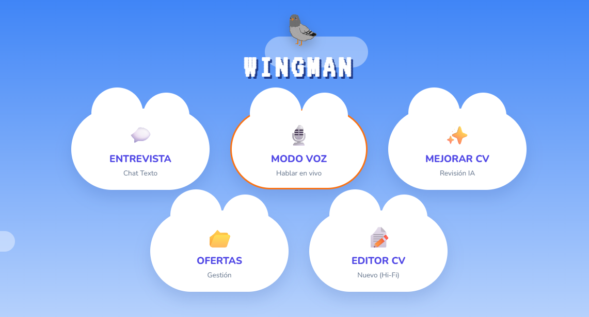

# Wingman | Gestor de Currículums


*Tu centro de operaciones para la gestión de CVs*

**Wingman** es una aplicación diseñada para agilizar tu búsqueda de empleo. Te permite editar y gestionar tus CVs en un solo lugar.

## Características Principales

### Editor de CV

*   **Edición en Tiempo Real**: Visualiza los cambios de tu currículum al instante.
*   **Estructura JSON**: Gestión de datos robusta y portátil.
*   **Diseño Profesional**: Plantillas limpias y optimizadas para ATS.

## Tecnologías

*   **Frontend**: React.js
*   **Estilos**: CSS Modules & Modern UI
*   **Persistencia**: LocalStorage

## 📦 Instalación y Uso

1.  **Clonar el repositorio**:
    ```bash
    git clone https://github.com/manuelmarcanoc/wingman.git
    cd wingman
    ```

2.  **Instalar dependencias**:
    ```bash
    npm install
    ```

3.  **Arrancar la aplicación**:
    ```bash
    npm start
    ```
    Abre [http://localhost:3000](http://localhost:3000) en tu navegador.

## 🤝 Contribución

¡Las contribuciones son bienvenidas! Si tienes una idea para mejorar Wingman:

1.  Haz un Fork del proyecto.
2.  Crea una rama para tu "feature" (`git checkout -b feature/nueva-funcionalidad`).
3.  Haz Commit de tus cambios (`git commit -m 'Añadir nueva funcionalidad'`).
4.  Haz Push a la rama (`git push origin feature/nueva-funcionalidad`).
5.  Abre un Pull Request.
