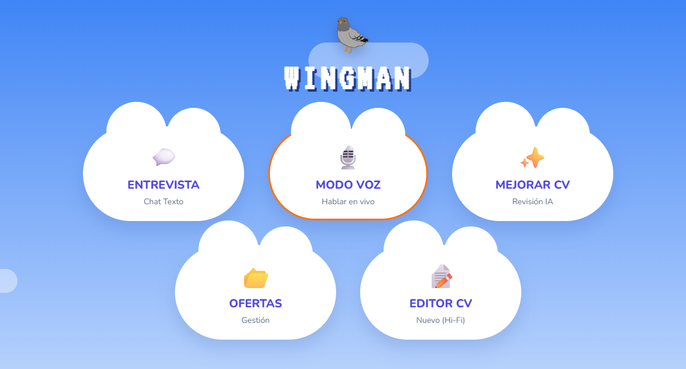

# Wingman | Tu Compañero de Búsqueda de Empleo 🕊️


*Tu centro de operaciones IA para dominar el mercado laboral*

**Wingman** es una aplicación web diseñada para agilizar tu búsqueda de empleo. Combina herramientas de gestión de CVs, entrevistas simuladas con IA, análisis de compatibilidad y mucho más.

## 🚀 Características Principales

### 📝 Editor de CV
- **Edición en Tiempo Real**: Visualiza los cambios de tu currículum al instante
- **9 Templates Profesionales**: Moderno, Minimalista, Pixel Art, Ejecutivo, Creativo, Editorial, Oscuro, Vanguardia, Y2K
- **Exportación PDF**: Genera PDFs de alta calidad con un clic
- **Foto de Perfil**: Sube tu foto directamente al CV
- **CRUD Multi-CV**: Crea y gestiona múltiples currículums

### 🎓 CV Guiado
- Crea tu currículum contestando preguntas paso a paso
- Selector de centro educativo con base de datos de centros españoles
- Elige plantilla al finalizar

### 🎤 Entrevista con IA
- **Chat**: Practica entrevistas escritas con IA (Google Gemini)
- **Modo Voz**: Entrevista hablada con reconocimiento y síntesis de voz (Web Speech API)
- **Feedback en tiempo real**: La IA evalúa cada respuesta
- **Conclusión final**: Tras 4 rondas, obtén un veredicto completo
- **Contexto de oferta**: Practica con una oferta específica o en modo general

### 📂 Gestión de Ofertas
- Añade y gestiona ofertas de empleo
- Estados: Pendiente → Aplicada → Entrevista → Aceptada/Rechazada
- **Análisis Match IA**: Compara tu CV vs una oferta con inteligencia artificial
- Practica entrevistas directamente desde una oferta
- **Compartir en LinkedIn**: Comparte ofertas en tu red profesional

### 🌓 Experiencia Visual
- Modo claro con paloma volando y nubes
- **Modo oscuro** con murciélago y luna
- Animaciones pixel art y diseño retro

## 🛠️ Tecnologías

| Capa | Tecnología |
|---|---|
| Frontend | React 19 |
| Estilos | CSS con variables, dark mode |
| IA | Google Gemini API (`@google/generative-ai`) |
| Voz | Web Speech API (reconocimiento + síntesis) |
| Auth | Firebase Auth (mock para Sprint 2) |
| Persistencia | LocalStorage |
| PDF | html2canvas + jsPDF |
| Icons | lucide-react |

## 📦 Instalación y Uso

1.  **Clonar el repositorio**:
    ```bash
    git clone https://github.com/Drareg04/Wingman.git
    cd Wingman
    ```

2.  **Instalar dependencias**:
    ```bash
    npm install
    ```

3.  **Configurar variables de entorno** (opcional, para IA real):
    ```bash
    cp .env.example .env
    # Editar .env y añadir REACT_APP_GEMINI_API_KEY
    ```

4.  **Arrancar la aplicación**:
    ```bash
    npm start
    ```
    Abre [http://localhost:3000](http://localhost:3000) en tu navegador.

## 👥 Equipo

- **Marc Sorribes** 
- **Manuel Marcano**
- **Gerard Lorza**

## 🤝 Contribución

1.  Haz un Fork del proyecto.
2.  Crea una rama para tu "feature" (`git checkout -b feature/nueva-funcionalidad`).
3.  Haz Commit de tus cambios (`git commit -m 'Añadir nueva funcionalidad'`).
4.  Haz Push a la rama (`git push origin feature/nueva-funcionalidad`).
5.  Abre un Pull Request.
